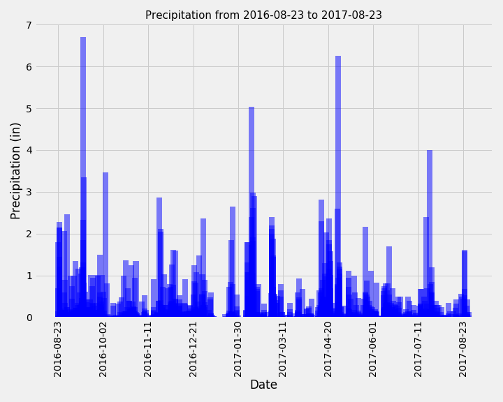
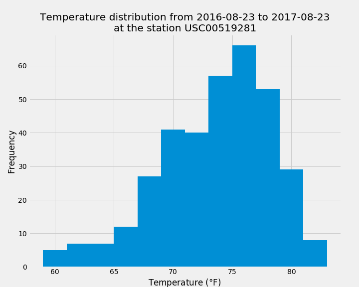

# sqlalchemy-challenge
In this repository, an [analysis of weather data](climate_starter.ipynb) for the Hawaii is performed using AQLAlchemy and Pandas and matplotlib to create the data visualization. Finally, an [API web-app](app.py) was created by using Flask.

## 1. Weather data analysis for Hawaii
SQLAlchemy was connected to the database ([hawaii.sqlite](hawaii.sqlite)) and the following results were obtained:

- A query was designed to retrieve the last 12 months of precipitation data and  the results were plotted. \
\

- A query to identify the most active weather station was developed and the lowest, highest, and average temperature were evaluated.\
                        The most active satation was USC00519281: \
                        Lowest temperture recorded: 54.0\
                        Highest temperature recorded: 85.0\
                        Average temperature: 71.7\
- The data were filtered to retrieve the last 12 months of temperature observation data (TOBS) for the most active station and an histogram was created.\
 \

## 2. Hawaii API
The web-app is based on the queries created in the part 1. / 
The following routes were defined
```
/
```
This is the home-route and it is giving information on all the other possible routes
```
/api/v1.0/precipitation
```
This route returns a JSON of the precipitation for every date in the database:
```JSON
[
{
"2010-01-01": 0.08
},
{
"2010-01-02": 0
},
{
"2010-01-03": 0
},
{
"2010-01-04": 0
},
...]
```
```
/api/v1.0/stations
```
This route returns a JSON with the information of each station.
```JSON
[
{
"elevation": 3,
"id": 1,
"latitude": 21.2716,
"longitude": -157.8168,
"name": "WAIKIKI 717.2, HI US",
"station": "USC00519397"
},
{
"elevation": 14.6,
"id": 2,
"latitude": 21.4234,
"longitude": -157.8015,
"name": "KANEOHE 838.1, HI US",
"station": "USC00513117"
},
...
]
```
```
/api/v1.0/tobs
```
This route returns a JSON of the temperature for every date in the database for the last year of data.
```JSON
[
{
"2016-08-23": 81
},
{
"2016-08-23": 76
},
{
"2016-08-23": 80
},
{
"2016-08-23": 80
},
...]
```
```
/api/v1.0/<start>
```
This route returns a JSON of the maximum, minimum and average temperature for the dates after the start date chosen (included).
```JSON
{
"Avg_Temp": 73.2601909461489,
"Max_Temp": 87,
"Min_Temp": 53
}
```
```
/api/v1.0/<start>/<end>
```
This route similarly to the previous one reports the maximum, minimum and average temperature for a subset of dates contained in the database. Start and end dates are included.
```JSON
{
"Avg_Temp": 72.70616603513606,
"Max_Temp": 87,
"Min_Temp": 56
}
```
## 3. Bonus part and Observations
This time for lack of time on my side I was not able to do the bonus part by the deadline. I will complete that section as soon as I will have some free time to dedicate to this section again. The files [temp_analysis_bonus_1_starter.ipynb](temp_analysis_bonus_1_starter.ipynb) and [temp_analysis_bonus_2_starter.ipynb](temp_analysis_bonus_2_starter.ipynb) are not completed. \
In the same fashion I believe the last two routes could have been consensed in a lot less lines of code but I have not had time to study how to do it. I am planning on trying to dig up a little bit more to improve my overall knowledge of the Flask method. I am also planning to try adding some more lines of code to make the app understand dates in a format different from yyyy-mm-dd and possibly raise some useful error code if the date is typed incorrectly.
